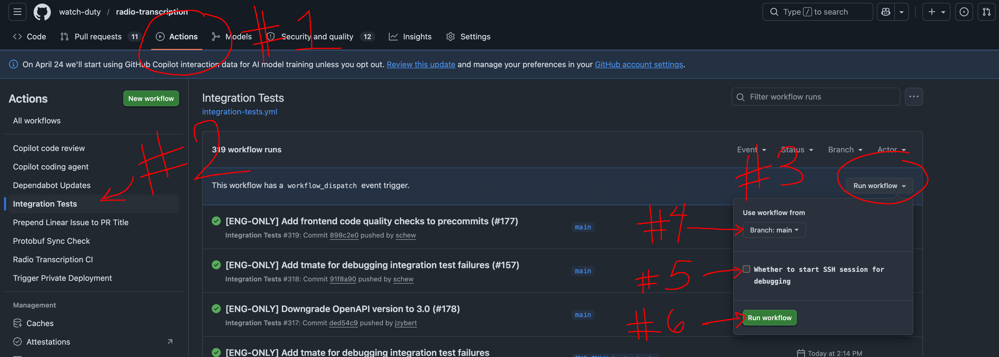

# Contributing

## Quick Start

* Run Backend (and API services) locally: `mise run dev:start`
* Run Frontend and Backend locally: `mise run dev`
* Setup environment for Frontend development against GCP backend: `mise run dev:remote:init`
* Run Frontend and Frontend Proxy API against GCP backend: `mise run dev:remote`

More mise commands can be found in [.mise.toml](/.mise.toml).

## Pre-requisites

1. Install Mise (`curl https://mise.run | sh` or `brew install mise` - https://mise.jdx.dev/getting-started.html)
2. Install tools: `mise install`
3. Optionally activate mise venv: `eval "$(mise activate zsh)"` (see docs above for other options)
4. Install Docker: `brew install --cask docker`
5. (Optional) Install Google Cloud SDK (required for hybrid remote development): `brew install --cask google-cloud-sdk`

## Backend tools

* Language: Python
* Package management: `uv`
* Formatting and linting: `ruff`
* Type-checking: `ty check`
* Unit testing: Python `unittest`

## Pipeline E2E Local Development
On a high level, this local pipeline runs the following:
#### Shared infrastructure
1. Pub/Sub emulator (manages all PubSub topics for each Pub/Sub instance in the pipeline)
2. GCS emulator (manages all GCS buckets for audio storage in the pipeline)
3. Mock Audio server (simulates all the supported audio streams for testing e.g. Icecast and API polling). See [documentation/local-dev-mock-audio.md](documentation/local-dev-mock-audio.md) for instructions on adding test audio files.

#### Pipeline
1. Audio ingestion service (fetches audio from streams and uploads to GCS)
2. Transcription pipeline service (for processing audio into transcript text)
3. Rules Evaluation service (to process transcription events)
4. Notification service (to send alerts when rules match)

#### API Management Services
1. Rules Management service (to manage keywords and evaluation logic)
2. Transcripts API services
3. Frontend API (proxy for rules, transcript, and feed management)
4. Mock server (to receive and display mock notifications)

Integration tests run an automated E2E test on startup.

> [!NOTE]
> `local_dev/test_data.sql` is used to seed the database with dummy feeds and rules for local development (`mise dev:start`). It is explicitly ignored in the integration tests (`mise test:e2e`) to ensure tests run in a clean, isolated database environment.

> [!TIP]
> **Transcription engine type:** By default, local development uses the `mock` transcriber to save resources. If you want to run with the local Whisper API service, set `TRANSCRIBER_TYPE=local_whisper` in `local_dev/LOCAL.env` before starting the services.

### Running the System Locally

Depending on whether you want to run the environment fully locally or connect to remote GCP dev services, choose one of the options below:

#### Option A: 100% Local Development (No GCP required)
This option runs the entire pipeline (ingestion, transcription, rules, database, and FE Proxy API) inside local Docker containers, and boots the React UI on your host machine.

1. Start the entire local environment:
   ```bash
   mise run dev
   ```
   > [!TIP]
   > Use `mise run dev:add-audio` to quickly mock incoming audio files for specific feeds. See [documentation/local-dev-mock-audio.md](documentation/local-dev-mock-audio.md) for usage instructions.

   *Alternatively, to start the local environment using the local Whisper STT service instead of mock:*
   1. Set `TRANSCRIBER_TYPE=local_whisper` in `local_dev/LOCAL.env`.
   2. Start the system:
      ```bash
      mise run dev:whisper
      ```
2. View container logs:
   ```bash
   mise run dev:log
   ```
3. Stop the system and clean up volumes:
   ```bash
   mise run dev:stop
   ```

#### Option B: Hybrid Remote Development
To develop your local frontend code (FE Proxy and/or UI) while connecting directly to dev environment in gcp, see the **Frontend Development with Remote GCP Services** section below.

Send a test payload to the Transcription PubSub (ingested by the Rules Evaluation service) to test the path from the Rules Evaluation service to the Notification service.
```bash
# Note: This script is run automatically by the integration-test service on startup.
# To run it again manually, use the following command:
docker-compose exec rules-evaluation python /app/test_evaluation_publish.py
```

## Integration and E2E Tests
We categorize our non-unit tests into three levels to balance speed and coverage. These are located under `integration_tests/`:

1. **Component Tests**: Isolated tests for database stores using `testcontainers`.
   * Run all: `mise run test:component`
   * Run specific: `mise run test:component:rules` or `test:component:feeds`

2. **API Tests**: Tests targeting running services via HTTP.
   * Run all: `mise run test:api`

3. **End-to-End (E2E) Tests**: Full system flow tests involving multiple services and the Pub/Sub emulator.
   * Run in an isolated environment (Docker handles lifecycle): `mise run test:e2e`
   * Run against a running background environment: `mise run test:e2e:local` (Requires you to start the environment first)

> [!TIP]
> **Testing E2E with Whisper:**
> By default, E2E tests use the `mock` transcriber. To run E2E tests with the real local Whisper container:
> 1. Edit `local_dev/LOCAL.env` and set:
>    ```ini
>    TRANSCRIBER_TYPE=local_whisper
>    COMPOSE_PROFILES=local-whisper
>    ```
> 2. Run `mise run test:e2e`.
> 
> *Note: Running with Whisper locally requires downloading model weights and is CPU/RAM intensive. We do not have baked in GPU support at the moment*

For more details on the architecture and local execution of the pipeline, see the **Pipeline E2E Local Development** section above.

## Frontend tools

* Language: Typescript
* Package management: `yarn` (install with `npm install --global yarn`)
* Formatting and linting: `prettier` and `eslint`
* Bundling: `vite` (https://vite.dev/)
* Testing: [Vitest](https://vitest.dev/) with [React Testing Library](https://testing-library.com/react)
* Install Node (https://nodejs.org/en/download/)
* (Optional) Install Firebase CLI (https://firebase.google.com/docs/cli) for hosting deployments


## Frontend Development with Remote GCP Services

When you finish this section, you'll have the proxy API running on `:8080` and the UI on `:5173`, with Google sign-in working and the UI reading from the dev backend services in GCP.

The frontend consists of two pieces that must both be running in separate terminals:
- **Proxy API** (`frontend/api`) — Node/Express service on `:8080` that handles auth and forwards requests to the dev backend Cloud Run services.
- **UI** (`frontend/transcription-ui`) — Vite-served React app on `:5173`.

All commands below assume you're running from the top level of the repo.

### 1. One-time setup

#### 1a. Install gcloud and sign in

Install the gcloud CLI (either via Homebrew on macOS or from the [official installer](https://docs.cloud.google.com/sdk/docs/install-sdk)), then:

```bash
# On macOS (optional):
brew install --cask google-cloud-sdk

# Initialize and log into your Google Account:
gcloud init                                  # follow prompts; pick the GCP project
gcloud config set account <your work email>
gcloud config set project <your project ID>
```

#### 1b. Gather project-specific values

You'll plug these into `.env.local` files later. Look them up now:

- **GCP project ID** — GCP Console project picker, or `gcloud projects list`.
- **Service account name** for the proxy API — GCP Console → IAM & Admin → Service Accounts (look for one named like `*-api-dev`), or:
  ```bash
  gcloud iam service-accounts list --project=<your project ID>
  ```
- **OAuth 2.0 Web application Client ID and Secret** — GCP Console → APIs & Services → Credentials → "OAuth 2.0 Client IDs". Pick the entry of type "Web application". Verify that `http://localhost:5173` is listed under **Authorized JavaScript origins** (add and save if it isn't — changes take ~30s to propagate).
- **OAuth Client Secret** — same Credentials page. Newer clients only show it once at creation. If hidden, check Secret Manager:
  ```bash
  gcloud secrets list --project=<your project ID>           # look for one matching oauth/client/auth
  gcloud secrets versions access latest --secret=<secret-name> --project=<your project ID>
  ```
  > **Note on copy-pasting secrets:** ensure no trailing whitespace ends up in your `.env.local`. A trailing `%` in your terminal output from `gcloud secrets versions access` is a zsh display marker indicating no trailing newline — it is **not** part of the secret value.

  If neither source has a usable value, **Reset Secret** on the OAuth client in the Console — coordinate with the team first, since this invalidates the secret in any deployed environment using it.

#### 1c. Get permission to impersonate the service account

The proxy API makes calls to GCP services as the service account, so your user account needs the "Service Account Token Creator" role on that SA.

> **Note:** this binding command requires `roles/iam.serviceAccountAdmin` on the service account, which most developers don't have. If you hit `PERMISSION_DENIED`, ask an admin to run it for you.

```bash
export SA_NAME=<your service account name for the API>
export PROJECT_ID=$(gcloud config get-value project)
export USER_EMAIL=$(gcloud config get-value account)
gcloud iam service-accounts add-iam-policy-binding \
    $SA_NAME@$PROJECT_ID.iam.gserviceaccount.com \
    --member="user:$USER_EMAIL" \
    --role="roles/iam.serviceAccountTokenCreator"
```

#### 1d. Impersonate the service account for Application Default Credentials

```bash
export SA_NAME=<your service account name for the API>
export PROJECT_ID=$(gcloud config get-value project)
gcloud auth application-default login --impersonate-service-account=$SA_NAME@$PROJECT_ID.iam.gserviceaccount.com
```

When you're done with frontend work, switch back to your default account with:
```bash
gcloud auth application-default login
```

#### 1e. Install shared frontend dependencies

The `frontend/common` package is consumed by both the API and the UI. **Note: This is automatically built and linked under the hood by `mise` tasks when you start the dev server.**

However, if you want to install and build it manually (e.g., to enable IDE type-checking immediately before starting the dev server), run:

```bash
yarn --cwd frontend/common install && yarn --cwd frontend/common build
```

### 2. Run the Remote Development Environment

You can run the frontend locally while connecting directly to the GCP dev environment. All configuration files can be generated automatically.

#### Step 2a: Initialize Environment Configs
Run the helper initialization task:
```bash
mise run dev:remote:init
```
This script will:
* Check that your local Application Default Credentials (ADC) are configured to impersonate the service account. If not, it will output the exact login command for you to run.
* Fetch all development endpoints from GCP and automatically write/update `frontend/api/.env.local` and `frontend/transcription-ui/.env.dev.local`.

#### Step 2b: Launch the local frontend

Depending on your dev workflow, run one of the following commands:

* **To develop both FE Proxy and UI locally (Recommended):**
  ```bash
  mise run dev:remote
  ```
  This unsets any conflicting local container environment variables, boots the local FE Proxy API at `http://localhost:8080`, boots the local UI at `http://localhost:5173`, and configures the UI to proxy `/api` calls through your local FE Proxy API.

* **To develop the UI only (without running local API):**
  ```bash
  mise run dev:remote:ui
  ```
  This boots only the UI at `http://localhost:5173` and configures the Vite server to proxy `/api` calls directly to the remote GCP API Gateway (spoofing the origin header to bypass browser CORS checks).


## Making Changes to Files
* run `mise format`
* run `mise lint`


## Pre-commit Hooks
This repository uses `pre-commit` to ensure code quality before pushing.
To install the pre-commit hook in your local Git repository:
```bash
uv run pre-commit install
```
After installation, `pre-commit` will automatically run on the changed files during `git commit`.

You can also run the pre-commit hooks manually on all files at any time:
```bash
uv run pre-commit run --all-files
```

## Debugging

### Github Workflows
If there is a workflow that is failing, and for the life of you, you cannot figure out why, you can open an SSH session into the workflow. Rerun the job by triggering a manual workflow.

Note that this is only available on workflows that have it configured. If you want to configure it for a new workflow, you'll need open a new PR and merge the configuration into main before the option is available for you.