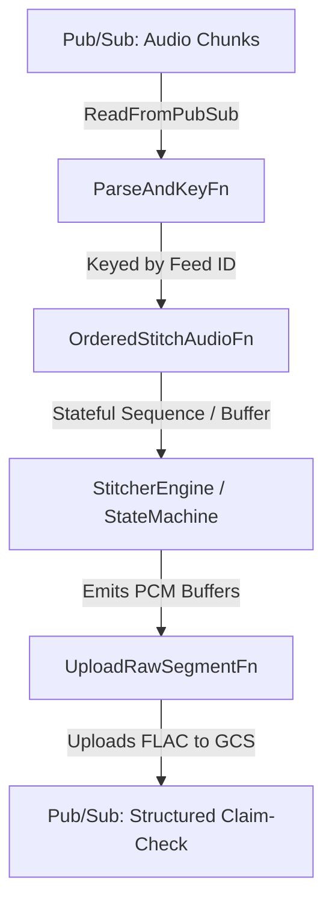

# Radio Transcription Segmentation Pipeline Architecture

This document outlines the architectural rationale, stream design patterns, and operational mechanics of Watch Duty's stateful audio segmentation pipeline. 

## 1. System Overview & Single Responsibility

Following the legacy streamlining refactoring, this pipeline has a focused single responsibility: **Ingesting continuous raw audio streams from emergency radio feeds, evaluating Voice Activity Detection (VAD), and correctly stitching those continuous audio chunks into coherent speech and non-speech segments.**

It operates as an exactly-once streaming topology deployed on Google Cloud Dataflow (Apache Beam), linking upstream audio collectors to downstream evaluation, transcription and notification services.

---

## 2. Rationale for Distributed State & Timer Mechanics

The canonical streaming `DoFn` (`OrderedStitchAudioFn`) implements highly specialized Apache Beam timer and state patterns to bridge distributed cloud infrastructure with Watch Duty's real-time emergency alerting invariants.

### A. Windmill Protection: Bounded Leases & Self-Chaining
When a streaming pipeline recovers from an extended network outage or spins up a fresh catch-up subscription, the jitter buffer accumulates thousands of incoming out-of-order audio files.
* **The Infrastructure Failure**: A naive streaming DoFn would attempt to unroll, sort, stitch, and emit all 5,000 chunks in a single worker `process()` transaction. This violates Google Cloud Windmill's strict 300-second RPC commit lease. The Dataflow worker would crash, throw a `LeaseExpiredException`, and retry the bundle infinitely—creating an unrecoverable "poison pill."
* **Our Rationale / Pattern**: The pipeline executes a **Clamped Self-Chaining Drain**. When the jitter buffer unrolls, `SequenceBuffer` clamps emissions to `MAX_CHUNKS_PER_WINDMILL_BUNDLE` (10 chunks). If remaining chunks exist, `OrderedStitchAudioFn` immediately schedules a watermark timer at the exact current `timestamp`. This instructs Windmill to successfully commit the current worker bundle lease and instantly spawn a fresh bundle to continue draining the backlog.

### B. Business Logic Protection: Historical Catch-up vs. Live Invariants
While self-chaining successfully prevents Dataflow from crashing during backfills, redriving massive historical slices poses an application-level threat to our real-time sequence tracking.
* **The Alerting Invariant Failure**: As backfilled slices are unrolled, a naive state machine would record those historical timestamps into our application-level live sequence tracker (`last_start_ms_state`) and trigger false overlap/corruption log spam.
* **Our Rationale / Pattern**: The DoFn actively evaluates `is_backfill` per element (checking if processing lateness exceeds our backfill threshold). When `is_backfill` is True, `StitcherEngine` bypasses overlap log warnings and suppresses sequence state updates. This guarantees that live alerting tracking remains completely unpolluted while historical catch-up audio is successfully processed.

### C. Dual Stale Transmission Timers (`StaleTimerManager`)
To guarantee that active radio transmissions are cleanly flushed under all real-world operational conditions, the DoFn maintains an elegant dual-timer architecture:
1. **`STALE_TIMER_EVENT` (`beam.TimeDomain.WATERMARK`)**: Operates in logical Event Time. As historical catch-up audio streams flow through the pipeline, transmissions are accurately split and closed based on true logical progression.
2. **`STALE_TIMER_PROC` (`beam.TimeDomain.REAL_TIME`)**: Operates in wall-clock Processing Time. If a live transmission window is actively open and an emergency scanner physically goes offline (meaning no incoming events arrive to advance Dataflow's watermark), the processing-time timer will fire in real-world wall-clock time to flush the final emergency audio segment.

### D. Dataflow Prime Right-Sizing: Memory as a vCPU Proxy
When running on Google Cloud Dataflow Prime, static machine sizing flags (`--machine_type`, `--worker_machine_type`), CPU platform experiments (`--experiments=min_cpu_platform=...`), and the `cpu_count` resource hint are explicitly unsupported and disabled (as they rely on Auto VM Selection, which Prime rejects).
* **The Compute Bottleneck**: While Silero VAD itself is lightweight (~53 ms per 15s chunk), our upstream recurrent denoiser (UL-UNAS) executes a sequential Python loop calling `ulunas_session.run()` across ~937 STFT frames per 15s chunk (~569 ms). During high-volume emergency scanner bursts, multiple hot feeds executing this loop concurrently on default 2-vCPU pods saturate the worker CPU cores and GIL, stretching bundle execution past Windmill's 300-second lease limit.
* **Our Rationale / Pattern**: Because Dataflow Prime dynamically right-sizes worker pod CPU allocations based on memory ratios (~1 vCPU per 4 GB of RAM on standard general-purpose compute families), we elevate the resource hint on `OrderedStitchAudioFn` to `.with_resource_hints(min_ram="16GB")`. This acts as an empirical proxy to discourage Prime from scheduling the recurrent denoiser loop on memory-constrained 1–2 vCPU default pods without needing to clamp bundle sizes. However, because Prime relies on opaque Auto VM Selection, this is not a guaranteed vCPU allocation: if Prime schedules pods on `highmem` families (8 GB RAM per vCPU), a 16 GB request yields only 2 vCPUs. Conversely, I/O-bound downstream transforms like `UploadRawSegmentFn` intentionally omit resource hints, running cleanly in Prime's lightweight default pool.

---

## 3. The Ordering / Jitter Buffer SLA (Dual-Timer Restoration Pattern)

Our `SequenceBuffer` maintains out-of-order jitter buffer timers to allow a brief waiting period for delayed predecessor chunks to arrive before accepting a logical feed gap. To guarantee prompt data delivery under all operational states, the pipeline implements a dual-timer pattern:

* **`gap_timer_event` (`beam.TimeDomain.WATERMARK`)**: Schedules the gap-timeout deadline in logical Event Time. During high-speed historical backfills, logical time moves much faster than wall-clock time, allowing gaps to be resolved instantly without introducing artificial wall-clock delays.
* **`gap_timer_proc` (`beam.TimeDomain.REAL_TIME`)**: Schedules the gap-timeout deadline in wall-clock Processing Time. This timer acts as a fallback and is scheduled **only** during live streaming (when `is_backfill` is evaluated as False). 

### Rationale for the Dual-Timer Pattern
If a live radio stream suffers an upstream disconnect or goes entirely silent, the logical Event-Time watermark stalls. If the pipeline relied solely on a watermark-based timer, the buffered audio would remain trapped until the runner's watermark finally advanced. The processing-time timer guarantees that even during absolute stream silence, the gap timeout fires exactly after the configured timeout (e.g., 60 seconds) in real-world wall-clock time, releasing buffered audio downstream for immediate transcription and preventing global watermark/system-lag monitoring spikes.

---

## 4. Pure-Python Decoupling (`StitcherEngine`)

A core design principle of this module is **State Machine Decoupling**. 
All voice activity evaluation, float-arithmetic gap tolerance checks, and `AudioStitchingStateMachine` transitions live entirely inside `StitcherEngine`—a completely stateless, pure-Python execution domain. 

By completely decoupling our audio stitching logic from Apache Beam's `StateSpec` and `TimerSpec` APIs, we ensure total pickling and serialization safety across Python worker processes while maintaining an exceptionally fast, highly targeted unit test suite (`test_transforms.py` and `test_stitcher_state.py`).
