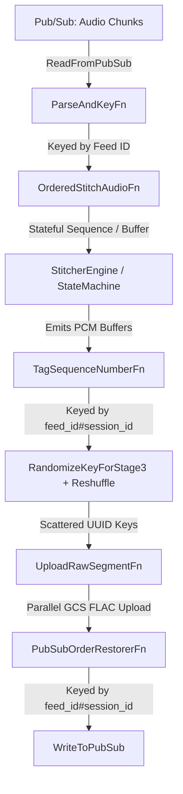

# Radio Transcription Segmentation Pipeline Architecture

This document outlines the architectural rationale, stream design patterns, and operational mechanics of Watch Duty's stateful audio segmentation pipeline. 

## 1. System Overview & Single Responsibility

Following the legacy streamlining refactoring, this pipeline has a focused single responsibility: **Ingesting continuous raw audio streams from emergency radio feeds, evaluating Voice Activity Detection (VAD), and correctly stitching those continuous audio chunks into coherent speech and non-speech segments.**

It operates as an exactly-once streaming topology deployed on Google Cloud Dataflow (Apache Beam), linking upstream audio collectors to downstream evaluation, transcription and notification services.

---

## 2. Rationale for Distributed State & Timer Mechanics

The canonical streaming `DoFn` (`OrderedStitchAudioFn`) implements highly specialized Apache Beam timer and state patterns to bridge distributed cloud infrastructure with Watch Duty's real-time emergency alerting invariants.

### A. Windmill Protection: Bounded Leases & Self-Chaining
When a streaming pipeline recovers from an extended network outage or spins up a fresh catch-up subscription, the jitter buffer accumulates thousands of incoming out-of-order audio files.
* **The Infrastructure Failure**: A naive streaming DoFn would attempt to unroll, sort, stitch, and emit all 5,000 chunks in a single worker `process()` transaction. This violates Google Cloud Windmill's strict 300-second RPC commit lease. The Dataflow worker would crash, throw a `LeaseExpiredException`, and retry the bundle infinitely—creating an unrecoverable "poison pill."
* **Our Rationale / Pattern**: The pipeline executes a **Clamped Self-Chaining Drain**. When the jitter buffer unrolls, `SequenceBuffer` clamps emissions to `MAX_CHUNKS_PER_WINDMILL_BUNDLE`. If remaining chunks exist, `OrderedStitchAudioFn` immediately schedules a watermark timer at the exact current `timestamp`. This instructs Windmill to successfully commit the current worker bundle lease and instantly spawn a fresh bundle to continue draining the backlog.

### B. Business Logic Protection: Historical Catch-up vs. Live Invariants
While self-chaining successfully prevents Dataflow from crashing during backfills, redriving massive historical slices poses an application-level threat to our real-time sequence tracking.
* **The Alerting Invariant Failure**: As backfilled slices are unrolled, a naive state machine would record those historical timestamps into our application-level live sequence tracker (`last_start_ms_state`) and trigger false overlap/corruption log spam.
* **Our Rationale / Pattern**: The DoFn actively evaluates `is_backfill` per element (checking if processing lateness exceeds our backfill threshold). When `is_backfill` is True, `StitcherEngine` bypasses overlap log warnings and suppresses sequence state updates. This guarantees that live alerting tracking remains completely unpolluted while historical catch-up audio is successfully processed.

### C. Dual Stale Transmission Timers (`StaleTimerManager`)
To guarantee that active radio transmissions are cleanly flushed under all real-world operational conditions, the DoFn maintains an elegant dual-timer architecture:
1. **`STALE_TIMER_EVENT` (`beam.TimeDomain.WATERMARK`)**: Operates in logical Event Time. As historical catch-up audio streams flow through the pipeline, transmissions are accurately split and closed based on true logical progression.
2. **`STALE_TIMER_PROC` (`beam.TimeDomain.REAL_TIME`)**: Operates in wall-clock Processing Time. If a live transmission window is actively open and an emergency scanner physically goes offline (meaning no incoming events arrive to advance Dataflow's watermark), the processing-time timer will fire in real-world wall-clock time to flush the final emergency audio segment.

---

## 3. The Ordering / Jitter Buffer SLA (Dual-Timer Restoration Pattern)

Our `SequenceBuffer` maintains out-of-order jitter buffer timers to allow a brief waiting period for delayed predecessor chunks to arrive before accepting a logical feed gap. To guarantee prompt data delivery under all operational states, the pipeline implements a dual-timer pattern:

* **`gap_timer_event` (`beam.TimeDomain.WATERMARK`)**: Schedules the gap-timeout deadline in logical Event Time. During high-speed historical backfills, logical time moves much faster than wall-clock time, allowing gaps to be resolved instantly without introducing artificial wall-clock delays.
* **`gap_timer_proc` (`beam.TimeDomain.REAL_TIME`)**: Schedules the gap-timeout deadline in wall-clock Processing Time. This timer acts as a fallback and is scheduled **only** during live streaming (when `is_backfill` is evaluated as False). 

### Rationale for the Dual-Timer Pattern
If a live radio stream suffers an upstream disconnect or goes entirely silent, the logical Event-Time watermark stalls. If the pipeline relied solely on a watermark-based timer, the buffered audio would remain trapped until the runner's watermark finally advanced. The processing-time timer guarantees that even during absolute stream silence, the gap timeout fires exactly after the configured timeout (e.g., 60 seconds) in real-world wall-clock time, releasing buffered audio downstream for immediate transcription and preventing global watermark/system-lag monitoring spikes.

---

## 4. Pure-Python Decoupling (`StitcherEngine`)

A core design principle of this module is **State Machine Decoupling**. 
All voice activity evaluation, float-arithmetic gap tolerance checks, and `AudioStitchingStateMachine` transitions live entirely inside `StitcherEngine`—a completely stateless, pure-Python execution domain. 

By completely decoupling our audio stitching logic from Apache Beam's `StateSpec` and `TimerSpec` APIs, we ensure total pickling and serialization safety across Python worker processes while maintaining an exceptionally fast, highly targeted unit test suite (`test_transforms.py` and `test_stitcher_state.py`).

---

## 5. Parallel Stage 3 Key Scattering & Per-Session Order Restoration

To resolve GCP production Dataflow worker CPU imbalances and duration clamps (`bundle_clamped_duration_limit`), the post-stitching pipeline implements a decoupled parallel execution and order restoration topology:

### A. Stage 3 Key Scattering (`RandomizeKeyForStage3` + `beam.Reshuffle()`)
Physical FLAC audio encoding and GCS upload (`UploadRawSegmentFn`) is stateless but CPU/IO intensive. If keyed strictly by `feed_id`, a single worker vCPU must sequentially encode all segments for active feeds, causing 99%+ single-core CPU saturation while other workers sit idle.
* **Mechanism**: Elements exiting Stage 2 are re-keyed with a randomized UUID suffix (`f"{feed_id}#{session_id}#{uuid.uuid4().hex}"`) and passed through `beam.Reshuffle()`.
* **Impact**: Windmill redistributes Stage 3 tasks uniformly across 100% of available worker vCPUs across the fleet, eliminating single-worker hotspots and duration clamps.

### B. Per-Session Monotonic Sequencing (`TagSequenceNumberFn`)
Immediately before key scattering, `TagSequenceNumberFn` (keyed by `feed_id#session_id`) assigns a strictly monotonic sequence number (`1, 2, 3...`) to each segment emitted by Stage 2 while elements are still in sequential order. Keying by `feed_id#session_id` isolates sequence counters per collector lease handover so collector reconnects do not cause sequence jumps.

### C. Stage 4 Per-Session Chronological Restorer (`PubSubOrderRestorerFn`)
Parallel Stage 3 execution causes segments to finish out of order. Before publishing downstream to Pub/Sub, `PubSubOrderRestorerFn` (keyed by `feed_id#session_id`) restores strict chronological order per session:
* **Normal Chronological Delivery**: Emits contiguous sequence numbers in order and drains buffered items, while setting `ordering_key = feed_id` on the output `PubsubMessage` for downstream Pub/Sub consumers.
* **Tunable Fallback Recovery Timer (`FALLBACK_DRAIN_TIMER`)**: Controlled by `--pubsub-fallback-drain-timeout-ms` (default: 180,000ms / 3 minutes). If a missing sequence number is delayed past the timeout, the timer force-drains buffered items out-of-order to prevent feed wedging, while recording skipped numbers in atomic state (`SKIPPED_SEQS_STATE`).
* **Zero Audio Segment Loss (`SKIPPED_SEQS_STATE`)**: If a skipped sequence number arrives late after the fallback timer has fired, `PubSubOrderRestorerFn` checks `SKIPPED_SEQS_STATE`. Recognizing it as a late arrival rather than a duplicate retry, it publishes the late segment immediately.
* **Deferred Session Key GC**: Because deployment updates use drain-and-relaunch (which starts with empty state on every release) and continuous Icecast feeds (`bcfy_feeds`) create only ~150–400 new session keys per day, dead session key accumulation is negligible (~1–2 MB between releases). Explicit timer-based key cleanup is deferred to avoid data loss on long disaster recovery backfills (observed max lag: 13 hours).

