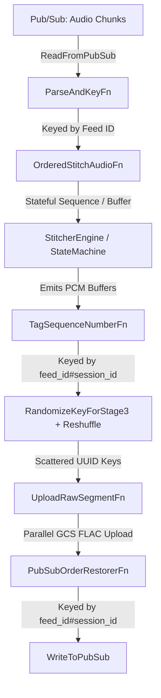

# Radio Transcription Segmentation Pipeline Architecture

This document outlines the architectural rationale, stream design patterns, and operational mechanics of Watch Duty's stateful audio segmentation pipeline. 

## 1. System Overview & Single Responsibility

Following the legacy streamlining refactoring, this pipeline has a focused single responsibility: **Ingesting continuous raw audio streams from emergency radio feeds, evaluating Voice Activity Detection (VAD), and correctly stitching those continuous audio chunks into coherent speech and non-speech segments.**

It operates as an exactly-once streaming topology deployed on Google Cloud Dataflow (Apache Beam), linking upstream audio collectors to downstream evaluation, transcription and notification services.

---

## 2. Rationale for Distributed State & Timer Mechanics

The canonical streaming `DoFn` (`OrderedStitchAudioFn`) implements highly specialized Apache Beam timer and state patterns to bridge distributed cloud infrastructure with Watch Duty's real-time emergency alerting invariants.

### A. Windmill Protection: Bounded Leases & Self-Chaining
When a streaming pipeline recovers from an extended network outage or spins up a fresh catch-up subscription, the jitter buffer accumulates thousands of incoming out-of-order audio files.
* **The Infrastructure Failure**: A naive streaming DoFn would attempt to unroll, sort, stitch, and emit all 5,000 chunks in a single worker `process()` transaction. This violates Google Cloud Windmill's strict 300-second RPC commit lease. The Dataflow worker would crash, throw a `LeaseExpiredException`, and retry the bundle infinitely—creating an unrecoverable "poison pill."
* **Our Rationale / Pattern**: The pipeline executes a **Clamped Self-Chaining Drain**. When the jitter buffer unrolls, `SequenceBuffer` clamps emissions to `MAX_CHUNKS_PER_WINDMILL_BUNDLE`. If remaining chunks exist, `OrderedStitchAudioFn` immediately schedules a watermark timer at the exact current `timestamp`. This instructs Windmill to successfully commit the current worker bundle lease and instantly spawn a fresh bundle to continue draining the backlog.

### B. Business Logic Protection: Historical Catch-up vs. Live Invariants
While self-chaining successfully prevents Dataflow from crashing during backfills, redriving massive historical slices poses an application-level threat to our real-time sequence tracking.
* **The Alerting Invariant Failure**: As backfilled slices are unrolled, a naive state machine would record those historical timestamps into our application-level live sequence tracker (`last_start_ms_state`) and trigger false overlap/corruption log spam.
* **Our Rationale / Pattern**: The DoFn actively evaluates `is_backfill` per element (checking if processing lateness exceeds our backfill threshold). When `is_backfill` is True, `StitcherEngine` bypasses overlap log warnings and suppresses sequence state updates. This guarantees that live alerting tracking remains completely unpolluted while historical catch-up audio is successfully processed.

### C. Dual Stale Transmission Timers (`StaleTimerManager`)
To guarantee that active radio transmissions are cleanly flushed under all real-world operational conditions, the DoFn maintains an elegant dual-timer architecture:
1. **`STALE_TIMER_EVENT` (`beam.TimeDomain.WATERMARK`)**: Operates in logical Event Time. As historical catch-up audio streams flow through the pipeline, transmissions are accurately split and closed based on true logical progression.
2. **`STALE_TIMER_PROC` (`beam.TimeDomain.REAL_TIME`)**: Operates in wall-clock Processing Time. If a live transmission window is actively open and an emergency scanner physically goes offline (meaning no incoming events arrive to advance Dataflow's watermark), the processing-time timer will fire in real-world wall-clock time to flush the final emergency audio segment.

---

## 3. The Ordering / Jitter Buffer SLA (Dual-Timer Restoration Pattern)

Our `SequenceBuffer` maintains out-of-order jitter buffer timers to allow a brief waiting period for delayed predecessor chunks to arrive before accepting a logical feed gap. To guarantee prompt data delivery under all operational states, the pipeline implements a dual-timer pattern:

* **`gap_timer_event` (`beam.TimeDomain.WATERMARK`)**: Schedules the gap-timeout deadline in logical Event Time. During high-speed historical backfills, logical time moves much faster than wall-clock time, allowing gaps to be resolved instantly without introducing artificial wall-clock delays.
* **`gap_timer_proc` (`beam.TimeDomain.REAL_TIME`)**: Schedules the gap-timeout deadline in wall-clock Processing Time. This timer acts as a fallback and is scheduled **only** during live streaming (when `is_backfill` is evaluated as False). 

### Rationale for the Dual-Timer Pattern
If a live radio stream suffers an upstream disconnect or goes entirely silent, the logical Event-Time watermark stalls. If the pipeline relied solely on a watermark-based timer, the buffered audio would remain trapped until the runner's watermark finally advanced. The processing-time timer guarantees that even during absolute stream silence, the gap timeout fires exactly after the configured timeout (e.g., 60 seconds) in real-world wall-clock time, releasing buffered audio downstream for immediate transcription and preventing global watermark/system-lag monitoring spikes.

---

## 4. Pure-Python Decoupling (`StitcherEngine`)

A core design principle of this module is **State Machine Decoupling**. 
All voice activity evaluation, float-arithmetic gap tolerance checks, and `AudioStitchingStateMachine` transitions live entirely inside `StitcherEngine`—a completely stateless, pure-Python execution domain. 

By completely decoupling our audio stitching logic from Apache Beam's `StateSpec` and `TimerSpec` APIs, we ensure total pickling and serialization safety across Python worker processes while maintaining an exceptionally fast, highly targeted unit test suite (`test_transforms.py` and `test_stitcher_state.py`).

---

## 5. Parallel Stage 3 Key Scattering & Per-Session Order Restoration

To resolve GCP production Dataflow worker CPU imbalances and duration clamps (`bundle_clamped_duration_limit`), the post-stitching pipeline implements a decoupled parallel execution and order restoration topology:

> **Why the ordering machinery exists — read before removing it.**
>
> Sections B and C below (`TagSequenceNumberFn`, `PubSubOrderRestorerFn`, their state specs and timers) exist **solely** to preserve per-feed publish ordering. That is a **product requirement**, not an engineering preference: the Watch Duty UI and downstream consumers of this pipeline's output assume ordered Pub/Sub delivery.
>
> Only section A (key scattering) addresses the CPU-imbalance problem. Ordering was previously an emergent side-effect of Beam fusing Stage 3 onto Stage 2's key — breaking that fusion is what makes the restorer necessary.
>
> This matters because nothing in the code makes the requirement visible. Tracing the pipeline's immediate consumer (`normalization`) suggests ordering is unnecessary: it is a stateless per-message Cloud Function keyed by `segment_id` with no per-feed history. The consumers that depend on ordering sit further downstream. A reviewer reasoning only from this repository will conclude this machinery can be deleted. It cannot.

### A. Stage 3 Key Scattering (`RandomizeKeyForStage3` + `beam.Reshuffle()`)
Physical FLAC audio encoding and GCS upload (`UploadRawSegmentFn`) is stateless but CPU/IO intensive. If keyed strictly by `feed_id`, a single worker vCPU must sequentially encode all segments for active feeds, causing 99%+ single-core CPU saturation while other workers sit idle.
* **Mechanism**: Elements exiting Stage 2 are re-keyed with a randomized UUID suffix (`f"{feed_id}#{session_id}#{uuid.uuid4().hex}"`) and passed through `beam.Reshuffle()`.
* **Impact**: Windmill redistributes Stage 3 tasks across the worker fleet rather than pinning them to one vCPU per feed, removing the single-worker hotspots that caused the duration clamps.
* **Right-fitting**: Stage 3 carries `min_ram=STAGE3_MIN_RAM_RESOURCE_HINT` (4GB) rather than Stage 2's 16GB, because it holds no model and its working set is a few MB per in-flight segment. Prime's vertical autoscaling already trims the pool from 16.0 GiB to 6.0 GiB against a 3.22 GiB peak, so this mostly starts the pools at the real requirement instead of having them corrected into it. Diverging from Stage 2's hint also splits the two into separate environments, which independently forces the fusion break — but that is a side effect, not the mechanism. The `Reshuffle` above is what this design relies on, since it also scatters the key; a fusion break without the re-key would leave Stage 3 concentrated on the feed's key owner, just in a different pool.

### B. Per-Session Monotonic Sequencing (`TagSequenceNumberFn`)
Immediately before key scattering, `TagSequenceNumberFn` (keyed by `feed_id#session_id`) assigns a strictly monotonic sequence number (`1, 2, 3...`) to each segment emitted by Stage 2 while elements are still in sequential order. Keying by `feed_id#session_id` isolates sequence counters per collector lease handover so collector reconnects do not cause sequence jumps.

### C. Stage 4 Per-Session Order Restorer (`PubSubOrderRestorerFn`)
Parallel Stage 3 execution causes segments to finish out of order. Before publishing downstream to Pub/Sub, `PubSubOrderRestorerFn` (keyed by `feed_id#session_id`) restores the order the segments were sequenced in.

**Ordering is best-effort with a bounded delay, not a guarantee.** Two caveats matter to downstream consumers:
1. Sequence numbers reflect **arrival order at `TagSequenceNumberFn`**, not audio timestamps. Two collectors briefly overlapping on one feed during a lease handover interleave nondeterministically — the same behaviour that existed before Stage 3 was parallelized.
2. The fallback timer below **publishes out of order by design** when a segment is late.

> **Open question for the customer.** Caveat 2 is a partial violation of the ordering requirement, and the tradeoff is theirs to make rather than ours: hold everything until the missing segment arrives (strict ordering, but that feed produces **no** output until it resolves), or publish the rest and slot the late segment in behind it (current behaviour — output keeps flowing, occasionally out of sequence). The current default assumes late-but-present beats absent for emergency dispatch audio, which is an assumption encoded in a constant, not a decision anyone signed off.
>
> The answer also depends on what "ordered" means to them — strictly monotonic on the topic, sortable on arrival, or merely not interleaved across feeds — and on whether the UI **sorts by `start_timestamp` or appends in arrival order**. If it sorts, the fallback is harmless. If it appends, a fallback drain produces visibly out-of-sequence output. Note that `SegmentedAudio` carries no marker distinguishing an out-of-order arrival from a normal one; the only signal is a `start_timestamp` earlier than its predecessor's.

* **Normal Delivery**: Emits contiguous sequence numbers in order and drains buffered items, while setting `ordering_key = feed_id` on the output `PubsubMessage` for downstream Pub/Sub consumers.
* **Tunable Fallback Recovery Timer (`FALLBACK_DRAIN_TIMER`)**: Controlled by `--pubsub_fallback_drain_timeout_ms` (default: 600,000ms / 10 minutes). If a missing sequence number is delayed past the timeout, the timer force-drains buffered items out-of-order to prevent feed wedging, while recording skipped numbers in `SKIPPED_SEQS_STATE`. 600s is a deliberately conservative starting point, not a tuned value: lower it only against observed `pubsub_order_gap_resolution_seconds` data, since erring long costs no latency on the normal path while erring short publishes out of order silently.
* **Late Arrival Recovery (`SKIPPED_SEQS_STATE`)**: If a skipped sequence number arrives late after the fallback timer has fired, `PubSubOrderRestorerFn` checks `SKIPPED_SEQS_STATE`. Recognizing it as a late arrival rather than a duplicate retry, it publishes the late segment immediately — behind the segments that overtook it. Retention is capped at `MAX_TRACKED_SKIPPED_SEQS`; eviction past that cap is the one path that discards a segment, and it increments `pubsub_order_skipped_seqs_abandoned`. That counter is the only signal distinguishing audio genuinely lost from audio merely delayed.
* **Deferred Session Key GC**: Because deployment updates use drain-and-relaunch (which starts with empty state on every release) and continuous Icecast feeds (`bcfy_feeds`) create only ~150–400 new session keys per day, dead session key accumulation is negligible (~1–2 MB between releases). Explicit timer-based key cleanup is deferred to avoid data loss on long disaster recovery backfills (max lag observed across all collector types: 13 hours; not yet re-scoped to `bcfy_feeds`). If it is ever added, note that `TagSequenceNumberFn` must not be cleared before `PubSubOrderRestorerFn`: a reset sequence counter feeding a restorer that still expects a higher number causes late segments to be silently dropped as duplicates.

---

## 6. Operating This Pipeline

### Deployment requires drain-and-relaunch, not an in-place update

Stages 2-4 add stateful DoFns, a `beam.Reshuffle()`, and new `StateSpec`/`TimerSpec` declarations mid-graph. Dataflow's in-place `--update` compatibility check is expected to reject that, so releases drain the running job and launch a fresh one.

Two consequences worth planning around:
* **Rollback is not instant.** Reverting means another drain-and-relaunch, not a flag flip.
* **All Beam state starts empty on every release.** This is why explicit session-key garbage collection is deferred (see §5C) — each deploy already reclaims it.

### What to watch

`PubSubOrderRestorerFn` emits these under the `PubSubOrderRestorerFn` metrics namespace. They are not interchangeable; each answers a different question.

| Metric | Healthy value | What a non-zero value means |
|---|---|---|
| `pubsub_order_skipped_seqs_abandoned` | **0** | **Audio was actually lost.** A skipped sequence number aged out of `SKIPPED_SEQS_STATE` before its segment arrived. This is the only metric that distinguishes lost audio from delayed audio — everything else here is recoverable. |
| `pubsub_order_fallback_drains` | **0** | **Downstream received segments out of sequence.** No audio was lost, but the ordering requirement (§5) was violated for that feed, and consumers assume ordered delivery. Sustained non-zero means `--pubsub_fallback_drain_timeout_ms` is tighter than real Stage 3 upload skew, or a feed is genuinely stuck. Treat a rising count as a customer-visible issue, not just a tuning signal. |
| `pubsub_order_stall_warnings` | **0** | The fallback timer itself is not firing. This is a watchdog on the fallback (threshold is `PUBSUB_STALL_WARN_TIMEOUT_MULTIPLE` × the drain timeout), not an alert on ordinary reordering. Investigate the timer, not the feed. |
| `pubsub_order_gap_resolution_seconds` | distribution | How long self-resolving gaps stayed open — the Stage 3 upload skew the drain timeout has to clear. **This is the input for tuning that timeout.** Only gaps that resolved on their own are sampled, so it is not biased toward the configured value. |
| `pubsub_order_buffer_depth` | small | How much reordering the Stage 3 fanout actually introduces. Consistently near zero means reordering is rare at current volume and the fallback is close to vestigial. |
| `pubsub_order_future_retries_suppressed` | any | Routine Windmill redelivery of a not-yet-ready segment. Expected churn; not actionable. |
| `pubsub_order_post_publish_retries_suppressed` | low | Redelivery of a segment **after** it was published. Relevant to the ordering guarantee — worth watching separately from the future-retry counter above. |

### If CPU balances but throughput does not improve

The point of §5A is to unpin Stage 3 from one vCPU per feed. If worker CPU
evens out and throughput still does not rise, suspect the **shared download
`ThreadPoolExecutor`** before suspecting the reshuffle.

`UploadRawSegmentFn` is stateless in the Beam sense — no `StateSpec`, no
`TimerSpec` — but it is not resource-free: it draws from a process-wide
download pool **shared with the stateful stitcher stage**, sized when Stage 3
was still fused onto Stage 2 and therefore serialized per key. Removing that
serialization means many more concurrent uploads contending for the same fixed
pool.

Watch `download_latency_ms` alongside worker CPU. Climbing download latency
with idle CPU is pool saturation, not a failed fanout.

### Tuning the fallback drain timeout

The 600s default is deliberately conservative, not measured. Its floor is the 231-311s peak system lag observed in production: a timeout inside that band would force-drain segments delayed by backlog rather than lost. `bcfy_feeds` produces roughly 150-400 sessions/day, so `pubsub_order_gap_resolution_seconds` accumulates slowly: **read its maximum and shape before trusting a percentile.** Tighten only once the distribution is populated, and expect skew to be worst during autoscaling events, when cold workers join the pool.

The asymmetry that justifies starting long: the fallback only arms when a gap exists, so a long timeout costs nothing on the normal path and merely delays recovery of a wedged feed — loudly, via `pubsub_order_stall_warnings`. A short one publishes out of order when nothing is wrong, silently.

### Caveat on timer-emitted metrics

`pubsub_order_fallback_drains`, `pubsub_order_stall_warnings`, and `pubsub_order_skipped_seqs_abandoned` are emitted from Beam timer callbacks. DirectRunner does not surface metrics emitted inside `@on_timer`, so these are unverifiable locally and were only confirmed by log output. On first deploy, check the counters move in step with the corresponding `[PubSub Order]` warning logs; flat counters alongside active logs indicate a metrics-reporting problem, not healthy operation.
