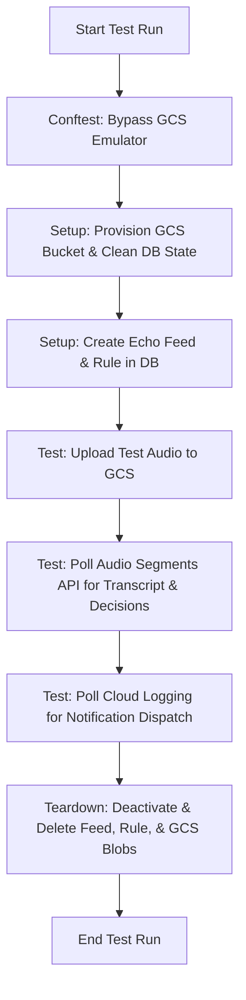

# Backend Pipeline Regression Tests

This directory contains the end-to-end (E2E) regression test suite for the backend radio transcription pipeline against a live environment.

The suite in `/regression_tests` verifies that when an audio file is ingested, it flows correctly through the transcription service, is evaluated against matching keyword rules, and triggers the expected notification dispatch in Cloud Logging.

---

## Architecture & Execution Flow

The test execution flows through the following sequential stages:



## Running the tests

### Prerequisite Environment Variables
The suite requires a dedicated service account credentials with access to the target GCP environment. Set the following environment variables before running:

```bash
export REGRESSION_TEST_CLIENT_ID="<google-oauth-client-id>"
export API_GATEWAY_URL="https://<api-gateway-endpoint>"
export GCP_PROJECT="<gcp-project-id>"
export GCP_REGION="us-central1"
export GCP_ECHO_BUCKET="<gcs-echo-recordings-bucket>"
```

### Execution Command
**Concurrency Constraint**: E2E integration tests share unique database resources (like the `regression-test-channel-echo` feed). Pytest in this repository runs with parallel workers (`-n auto`) by default, which will trigger database race conditions. You **MUST** force sequential execution.

```bash
# Run the integration tests sequentially via mise
mise run test:regression
```

---

## 4. Cleaning Up Resources (Teardown)

The integration tests are fully self-cleaning. However, if a test run is forcefully aborted midway, you can run the standalone teardown script to delete the GCS bucket audio blobs, de-register the Echo feed, and delete the keyword rules:

```bash
# Run the teardown utility via mise
mise run test:regression:teardown
```
