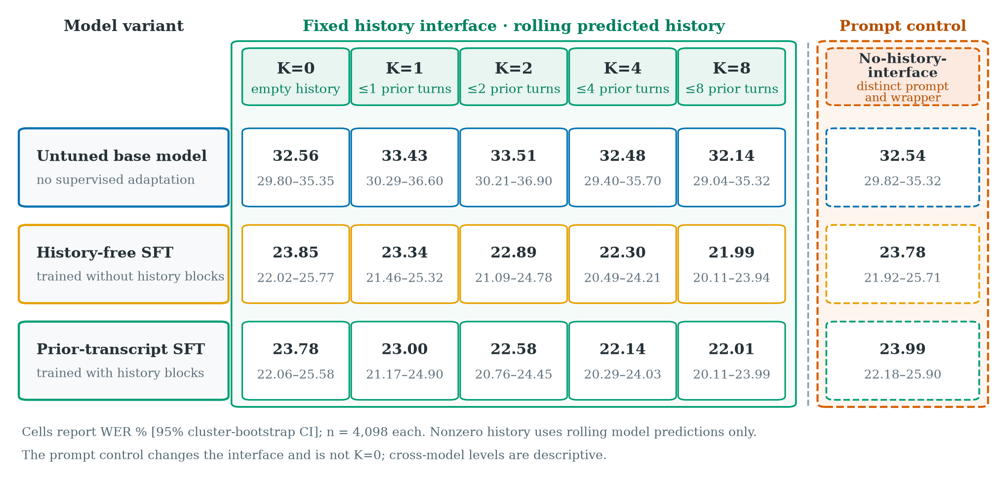
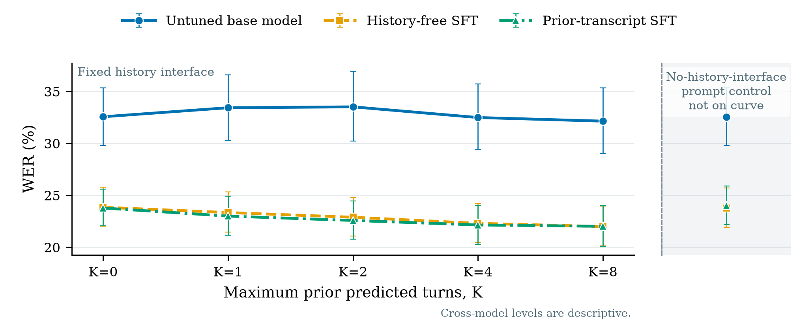

# Context Is an Interface: Utility and Failure Modes of Self-Predicted Transcript History for Emergency-Radio ASR

*Authors withheld pending internal governance review. Venue-neutral development-study draft.*

## Abstract

In deployed automatic speech recognition (ASR), earlier reference transcripts do not exist: a recognizer can condition only on its own earlier outputs. We evaluate that setting for emergency-radio audio with Gemini 3.1 Flash-Lite and two historical supervised-fine-tuning (SFT) variants, one trained without history blocks and one trained with prior-transcript blocks. The study processes 4,108 development clips (4,098 with nonempty normalized references) in independent rolling trajectories under one fixed history interface. Relative to its empty-history condition (K=0), an eight-turn self-predicted-history policy (K=8) lowers WER by 1.85 points for history-free SFT (95% CI [1.25, 2.42]; 0/10,000 Holm-adjusted bootstrap draws in the opposite tail) and 1.76 points for prior-transcript SFT ([1.05, 2.46]; 0/10,000). The difference between those improvements is only 0.09 points ([−0.65, 0.85]), and the K=8 systems reach 21.99% and 22.01% WER. Prior-transcript SFT instead has higher K=8 lexical reference-proxy diagnostics: +1.44 context-copy points among eligible-history rows ([0.66, 2.25]) and +1.11 prior-only points over all prediction tokens ([0.64, 1.61]). A prediction-derived, reference-absent entity-like intervention changes WER by 0.00, +0.36, and +0.52 points for the untuned base model, history-free SFT, and prior-transcript SFT; every interval crosses zero. Candidate adoption rises by 0.80, 0.40, and 1.80 points, with Holm-adjusted tail fractions of 0.45, 0.47, and 0.11. These are lexical diagnostics, not evidence of acoustic support or semantic hallucination. The study supports a narrow conclusion: predicted history helps both tuned rolling systems under the fixed interface, but it provides no detected differential WER benefit for prior-transcript SFT and coincides with more lexical overlap. Historically unmatched training jobs, endogenous histories, development-set reuse, and absent listening adjudication preclude causal SFT and semantic-safety claims.

## 1. Introduction

Emergency-radio transcription combines short, narrowband, noisy clips with operationally important names, unit identifiers, locations, and codes. Such details often recur across adjacent transmissions. Police-radio ASR research documents specialized language, short turns, and annotation disagreement ([Srivastava et al., 2024](https://doi.org/10.1109/SLT61566.2024.10832157)), while public-safety ASR work emphasizes operational extraction of locations and keywords ([Gartner et al., 2025](https://doi.org/10.3390/smartcities8050157)). Air-traffic-control corpora present related channel and terminology constraints ([Zuluaga Gomez et al., 2024](https://data.mlr.press/assets/pdf/v02-5.pdf)). An earlier transcript may therefore resolve a plausible written form that the current audio alone leaves ambiguous.

The same text creates a failure channel. A generative recognizer can copy a plausible unit or location that is not part of the current transmission, continue an earlier turn, or let history determine output length. This risk differs from ordinary contextual biasing, where a recognizer receives a constrained phrase list. Free-text history contains complete utterances and, in deployment, upstream ASR errors.

This paper asks a deployment-specific question: **can predicted transcript history improve the current transcript without giving prior text inappropriate authority?** The deployment constraint is fundamental. The current reference is used only for scoring after inference. It is never an input, never a history donor, and never available to the rolling schedule. Every main-matrix nonzero-history trajectory consumes only the same model variant's own strictly earlier usable predictions.

The motivating hypothesis treats context as a learned interface. The current audio should be the only authority for transcript content and span; prior text should assist only the written form of something already supported by that audio. A historical SFT job attempted to encode this rule with up to eight transcript-only prior turns, a current-audio part, and a supervised target containing only the current transcript. We compare the resulting model variant with a historical domain-SFT variant trained without a history interface.

The evidence is mixed and does not support the training hypothesis. Under the fixed history interface, K=8 improves WER over K=0 for both tuned variants. Prior-transcript SFT has no supported K=8 WER advantage and no larger K=0-to-K=8 response. It instead has higher history-overlapping lexical reference-proxy diagnostics. A reference-absent, prediction-derived entity-like intervention produces small candidate-adoption rates but no supported WER change. These automatic results characterize lexical sensitivity; they do not determine whether any output is acoustically unsupported.

This study contributes:

1. A prediction-only evaluation protocol that prevents reference, future, cross-split, and cross-trajectory text from entering a serving request.
2. A complete three-variant, five-window development matrix under a fixed history interface, a detached no-history-interface prompt control, and frozen predicted-context stress tests with paired source-clustered uncertainty.
3. A failure to support the strong learned-contract thesis: the historically prior-transcript-SFT rolling system has no detected WER advantage and has higher lexical reference-proxy diagnostics under eight-turn serving.
4. An integrity-oriented reproduction package that authenticates rolling request histories, provider artifacts, operational telemetry, and generated aggregate tables and figures.

The contribution is evaluation and evidence, not architectural novelty. We make no state-of-the-art or external-baseline claim.

## 2. Related work

### 2.1 Contextual and cross-utterance ASR

Dedicated contextual ASR uses phrase lists, bias encoders, or difficult negative examples to improve rare-word recognition while controlling over-biasing ([Pundak et al., 2018](https://doi.org/10.1109/SLT.2018.8639034); [Alon et al., 2019](https://doi.org/10.1109/ICASSP.2019.8682738)). Long-context and conversational systems instead propagate information across utterances, including acoustic representations and imperfect recognition histories ([Hori et al., 2021](https://doi.org/10.21437/Interspeech.2021-1643); [Wei et al., 2022](https://doi.org/10.21437/Interspeech.2022-10326); [Lee et al., 2024](https://aclanthology.org/2024.sigdial-1.30/)). PromptASR explicitly compares preceding ground-truth utterances with previous decoding results ([Yang et al., 2024](https://doi.org/10.1109/ICASSP48485.2024.10448264)), and retrieval-augmented ASR studies the selection of useful external text ([Siskos et al., 2025](https://aclanthology.org/2025.findings-emnlp.768/)). Our setting differs in two ways: the context consists of unconstrained radio transcripts, and only earlier model predictions are admissible at inference.

### 2.2 Audio-language models and adaptation

Speech-augmented language models expose transcription through a generative text interface ([Chen et al., 2024](https://doi.org/10.1109/ICASSP48485.2024.10447553); [Tang et al., 2024](https://openreview.net/forum?id=14rn7HpKVk)), while LoRA and speech-specific adaptations provide parameter-efficient specialization ([Hu et al., 2022](https://arxiv.org/abs/2106.09685); [Song et al., 2024](https://doi.org/10.21437/Interspeech.2024-892)). Contextualization through speech-language models can improve bias terms but degrade as distracting candidates increase ([Lakomkin et al., 2024](https://doi.org/10.1109/ICASSP48485.2024.10446898); [Gong et al., 2024](https://doi.org/10.21437/Interspeech.2024-965)). Gemini provides the common model family and managed SFT mechanism used here ([Gemini Team et al., 2024](https://doi.org/10.48550/arXiv.2403.05530); [Google Cloud, 2026a](https://docs.cloud.google.com/gemini-enterprise-agent-platform/models/gemini/3-1-flash-lite); [Google Cloud, 2026b](https://docs.cloud.google.com/gemini-enterprise-agent-platform/models/tuning/supervised-tuning)). We evaluate historical model variants rather than introduce a new adapter or architecture.

### 2.3 Predicted-history mismatch and unsupported output

Training/serving skew is a general source of behavioral change ([Breck et al., 2019](https://proceedings.mlsys.org/paper_files/paper/2019/file/928f1160e52192e3e0017fb63ab65391-Paper.pdf)). In contextual speech-language models, exposure to clean training history can create a clean-to-predicted-history mismatch; recent work directly studies noisy-history training and irrelevant-history attacks ([Guo et al., 2026](https://arxiv.org/abs/2603.24034)). Our evaluation removes clean history from serving altogether and measures each model variant's own autoregressive error propagation.

Generative ASR can emit fluent content unsupported by audio, especially under non-speech or difficult acoustic conditions ([Koenecke et al., 2024](https://doi.org/10.1145/3630106.3658996); [Barański et al., 2025](https://doi.org/10.1109/ICASSP49660.2025.10890105)), and audio-language models can report absent sound objects ([Kuan et al., 2024](https://doi.org/10.21437/Interspeech.2024-1076)). Ordinary insertions, textual overlap, and semantic fabrication are not equivalent ([Frieske and Shi, 2024](https://arxiv.org/abs/2401.01572)). We therefore call our automatic overlap measures **lexical reference-proxy diagnostics**. They screen dependence on supplied text; they do not establish semantic hallucination, acoustic support, continuation, or a target-boundary violation.

## 3. Predicted history as a serving interface

Let \(x_t\) be the current audio, \(y_t\) its scoring reference, and \(\hat y_t^{(k)}\) the prediction from a trajectory with maximum history window \(k\). For a fixed model variant and window, the rolling history is

\[
h_t^{(k)} = \operatorname{tail}_k\!\left(\hat y_i^{(k)} : s_i=s_t,\ e_i\le b_t,\ i<t,\ \hat y_i^{(k)}\ \text{usable}\right),
\]

where \(s\) is a source key, \(e_i\) is the earlier clip's end, and \(b_t\) is the current clip's start. Stable identifiers break timestamp ties. “Usable” excludes missing output, provider failure, blank text, and exact `[UNINTELLIGIBLE]`. An unusable frozen slot is omitted without looking for a replacement. The model then produces

\[
\hat y_t^{(k)} \sim p_\theta(\cdot\mid x_t,h_t^{(k)}).
\]

The schedule depends only on split, source, timing, duration, and audio identity. Reference text is held in a scoring-only structure and joined only after an entire cell is final. Thus \(y_i\) never appears in \(h_t^{(k)}\). Each model-variant/window combination is an independent rolling trajectory, so a prediction from one model variant or window cannot affect another.

The desired interface gives audio *content authority*. Predicted history may assist the spelling of an acoustically supported name, identifier, location, or technical term, but it should not supply words, determine transcript length, or trigger continuation. This rule is semantic. A token-level comparison with \(y_t\) cannot determine whether a repeated word was genuinely audible.

*[Vector version](figures/fig_task_contract.pdf); [generated figure contract](figures/data/predicted_history_concepts.json).*

### Historical model variants

All variants derive from the Gemini 3.1 Flash-Lite family. The history-free SFT checkpoint used 34,609 training rows (22.42 hours), adapter size 16, learning-rate multiplier 0.5, and epoch 6/step 1665. The prior-transcript SFT checkpoint used 16,919 rows (9.57 hours), adapter size 16, multiplier 0.75, and epoch 7/step 2538. Its training examples contained a numbered block of zero to eight earlier labeled transcript texts and only the current audio; the target contained only the current transcript. Those training histories were not rolling predictions, so the present prediction-only evaluation still introduces a clean-to-predicted-history exposure shift.

The untuned base model uses a floating publisher alias. An observed response-version-set fingerprint authenticates the execution reported here, but the alias is not an immutable model resource and cannot guarantee an identical future rerun.

These jobs do **not** form a controlled history-training intervention. They differ in corpus size and source mixture, 58 shared-span labels, prompt, input serialization, and temporal construction. The historical prior-transcript builder also used start-time ordering, whereas this study requires prior audio to end before the current clip begins. Provider-managed training randomness and several optimizer details are unavailable. Cross-variant gaps and interactions below therefore describe two bundled historical systems; they cannot identify the causal effect of prior-transcript SFT.

## 4. Data and experimental design

### 4.1 Development frame

The exact unmasked materialization used by the historical prior-transcript evaluation contains 4,108 clips from 615 source clusters and four source families, totaling 8,611.569 seconds (2.39 hours). Historical prompt and checkpoint decisions used this lineage, so every result is a **development-set estimate**, not held-out confirmation. The primary ASR population contains the common 4,098 rows whose references remain nonempty after canonical normalization. The ten normalized-empty rows remain in the 4,108-row provider, insertion-sensitivity, abstention, error, and latency censuses but never enter corpus WER or CER.

The study authenticates source-object generation, byte size, content digest, row census, model bindings, prompt hashes, and finalized prediction artifacts. These checks do not establish acoustic near-duplicate, incident, speaker, or conversation disjointness from training. A registered acoustic-overlap audit did not produce an admissible result; no acoustic-separation claim is made.

### 4.2 Main window matrix

We evaluate the untuned base model, history-free SFT, and prior-transcript SFT under a fixed history-interface prompt at maximum windows \(K\in\{0,1,2,4,8\}\), producing 15 primary cells. K=0 renders the same prompt and wrapper with an explicit empty-history block, zero prior turns, and only the current audio. K=1/2/4/8 use the same interface with each trajectory's own earlier predictions. Three additional cells use a frozen no-history-interface forensic prompt and current audio only; they are detached prompt controls, not points on the K-window curve. The resulting 18-cell matrix contains 73,944 registered requests. Temperature is 0 and the output limit is 512 tokens.

This distinction creates an important estimand boundary:

- **K=k minus K=0** holds the history prompt and serialization fixed and estimates the total effect of a self-predicted-history rolling policy with maximum window K. Because the trajectory changes autoregressively, this is not a one-request direct effect.
- **Adjacent K-window contrasts** hold the interface fixed and show where the response curve changes.
- **K=0 minus the no-history-interface prompt control** is a prompt/interface contrast at zero history. It is not part of the K-window curve.
- **Prior-transcript SFT minus history-free SFT** is a descriptive gap between historically unmatched jobs.
- **Differences of model-variant gaps** are descriptive interactions, not causal training effects.

The structural schedule contains eligible dependencies for 3,492 rows. Actual supplied history varies by model variant because earlier unusable outputs leave slots empty. At K=8, 3,449 untuned-base rows, 3,491 history-free-SFT rows, and 3,490 prior-transcript-SFT rows receive at least one prediction.

### 4.3 Counterfactual stress frame

Before stress inference, a deterministic seed selected 500 structurally eligible rows from 47 source clusters and three source families without consulting references or model outcomes. The control condition uses each model variant's authenticated ordered same-source K=8 rolling predictions. “Ordered same-source” describes donor provenance and ordering—not corrected or reference text. Three interventions keep the current audio, model variant, prompt, and reference fixed:

1. **Unrelated predicted:** plausible predictions from another source family, matched to the frozen history structure. Independent recordings have no common clock, so this is a noncausal foreign-context perturbation, not valid deployment history.
2. **Stale same-source predicted:** up to eight strictly older, nonadjacent prediction slots from the same source, ending before the earliest ordered same-source K=8 turn; unusable predictions remain omitted.
3. **Shuffled same-source predicted:** the ordered same-source K=8 turns with their order perturbed while preserving lexical inventory.

Ordered same-source K=8 and no-history-interface controls reuse exact main-matrix subsets. The nine new intervention/model cells add 4,500 requests. Two stress references normalize to empty, leaving 498 primary quality rows; all 500 remain in operational summaries. Stress prevalence is artificial and does not estimate deployment frequency.

A second, post-outcome exploratory stress intervention uses a fixed 500-row intent-to-treat frame. For each model variant, it supplies prediction-derived text containing an entity-like candidate that a private offline reference check establishes is absent from the current reference. References remain unavailable to request construction and are used only for scoring and that absence check. The intervention adds 1,500 requests. Candidate adoption is evaluated on all 500 rows; WER and other reference-quality metrics use the 498 normalized-nonempty rows. This construction tests lexical uptake under an enriched intervention, not the deployment prevalence of such candidates or whether an adopted candidate is unsupported by the audio.

### 4.4 Metrics and statistical analysis

Standard metrics are corpus WER and CER, substitutions, deletions, insertions, insertions per 100 reference words, and occurrence-weighted keyword recall. Blank or exact `[UNINTELLIGIBLE]` output is abstention; provider failure and missing output are separate.

A **context-copy event** occurs when a predicted contiguous span of at least three tokens appears within one supplied prior turn but not in the current reference. No span crosses a turn boundary. For a nonzero cell, the event rate divides by that cell's successful rows with nonempty tokenized history; rows without realized history enter neither numerator nor denominator. K=0 and the no-history-interface prompt control have copy metrics displayed as zero by construction rather than as eligible-row ratios; only K=0 is the structural origin of the fixed-interface curve. At K=8, the tuned-variant denominators are 3,481 rows for history-free SFT and 3,480 for prior-transcript SFT. The **prior-only-token rate** instead divides attributable token multiplicity by all prediction tokens. We also compute distinct-history-trigram yield, a deterministic opportunity-matched donor null, and matched excess copy. Longer windows contain more possible matches, so raw copy rates combine model behavior with opportunity-set size. None of these metrics measures acoustic support.

For the second stress intervention, **candidate adoption** is the fraction of all 500 assigned rows whose output contains the selected reference-absent entity-like candidate. Blank, error, and exact `[UNINTELLIGIBLE]` outputs count as non-adoption. This intent-to-treat lexical outcome does not determine whether the candidate was audible or semantically unsupported.

The analysis uses 10,000 paired hierarchical bootstrap draws with fixed seed 20260711, resampling source clusters and then rows. Main and stress populations use separate joint draw groups. We report 95% percentile intervals and absolute effects. For the fixed-interface curve, Holm correction is applied across the four K=0-to-K>0 contrasts separately for each model variant and metric; adjacent-window contrasts use separate four-member families. The entity-like stress uses three-variant families separately for each metric. Adjusted bootstrap tail fractions are secondary descriptive quantities, not calibrated parametric *p*-values ([Holm, 1979](https://www.jstor.org/stable/4615733)). Variant gaps and tuned-variant interactions reported below are descriptive and have no Holm value in this extension analysis. The cluster-aware design follows established ASR and hierarchical-bootstrap practice ([Bisani and Ney, 2004](https://doi.org/10.1109/ICASSP.2004.1326009); [Field and Welsh, 2007](https://doi.org/10.1111/j.1467-9868.2007.00593.x); [Ren et al., 2010](https://doi.org/10.1080/02664760903046102)).

## 5. Results

### 5.1 Predicted history lowers WER for both tuned systems under the fixed interface

All cell estimates and paired effects in this table use the common 4,098-row primary quality population.

*[Vector version](figures/fig_predicted_history_extension_matrix_v1.pdf); [generated aggregate data](figures/data/predicted_history_extension_v1.csv).*

| Model variant | K=0 WER | K=1 WER | K=2 WER | K=4 WER | K=8 WER | K=8 − K=0, points [95% CI] | Holm-adjusted tail fraction |
|---|---:|---:|---:|---:|---:|---:|---:|
| Untuned base model | 32.56 | 33.43 | 33.51 | 32.48 | 32.14 | −0.42 [−1.35, 0.66] | 0.83 |
| History-free SFT | 23.85 | 23.34 | 22.89 | 22.30 | **21.99** | **−1.85 [−2.42, −1.25]** | **0/10,000** |
| Prior-transcript SFT | 23.78 | 23.00 | 22.58 | 22.14 | **22.01** | **−1.76 [−2.46, −1.05]** | **0/10,000** |

All K conditions use the same prompt and serialization. Relative to K=0, K=8 lowers WER by 7.78% for history-free SFT and 7.41% for prior-transcript SFT. Both tuned point-estimate curves improve monotonically as permitted history grows. The untuned-base curve does not: K=1 and K=2 are worse than K=0, and its K=8 − K=0 interval crosses zero. These are end-to-end rolling-policy effects; each window generates the predictions that later requests in its own trajectory consume.

*[Vector version](figures/fig_predicted_history_extension_exact_p13_v1.pdf); [generated aggregate data](figures/data/predicted_history_extension_v1.csv).*

For the first predicted turn, K=1 − K=0 is −0.51 points for history-free SFT ([−1.01, 0.02]; Holm 0.0592) and −0.78 for prior-transcript SFT ([−1.27, −0.28]; Holm 0.0014). Their descriptive interaction is −0.27 points ([−0.90, 0.35]), so the point-estimate difference does not support a differential first-turn response. The gains accumulate by K=8. The complete fixed-interface cells, paired effects, sample sizes, intervals, and registered Holm values are in the generated [extension table](tables/predicted_history_extension_main.md).

The no-history-interface prompt control is only a detached interface check. K=0 minus that control is +0.02 WER points for the untuned base model ([−0.44, 0.50]), +0.06 for history-free SFT ([−0.38, 0.48]), and −0.22 for prior-transcript SFT ([−0.76, 0.28]). No Holm adjustment was registered for these three prompt/interface contrasts. Their intervals do not establish prompt equivalence, but their small point estimates show that the primary K=0-to-K=8 result is not numerically driven by a large zero-history prompt gap.

### 5.2 Prior-transcript SFT has no supported K=8 WER advantage

At K=8, the tuned rolling systems have nearly identical WER point estimates, and the interval supports neither system over the other. Each system supplies its own endogenous prior predictions, so this is a contrast between complete rolling systems rather than checkpoints conditioned on identical text. Their lexical reference-proxy behavior differs.

| K=8 metric | History-free SFT | Prior-transcript SFT | Prior-transcript − history-free [95% CI] |
|---|---:|---:|---:|
| WER, % | 21.99 | 22.01 | +0.02 [−0.63, 0.70] |
| CER, % | 15.05 | 15.15 | +0.09 [−0.41, 0.62] |
| Context-copy event proxy (span ≥3 tokens), % eligible-history rows | 2.96 | 4.40 | **+1.44 [0.66, 2.25]** |
| Prior-only tokens, % prediction tokens | 3.72 | 4.84 | **+1.11 [0.64, 1.61]** |
| Insertions / 100 reference words | 3.18 | 3.77 | **+0.58 [0.26, 0.90]** |

The differential K=0-to-K=8 WER response is +0.09 points for prior-transcript SFT relative to history-free SFT ([−0.65, 0.85]): the interval supports no larger WER benefit for either historical variant. The context-copy gap remains after subtracting the opportunity-matched donor null: matched excess copy is 2.86% for history-free SFT and 4.33% for prior-transcript SFT, a +1.47-point gap ([0.69, 2.29]). Because the extension's registered Holm families cover within-variant window contrasts rather than variant gaps or tuned-variant interactions, no Holm value is attached to these descriptive comparisons.

The study does not support the strong learned-contract hypothesis: no WER advantage is detected, while lexical reference-proxy diagnostics move in the opposite direction. Semantic safety remains unmeasured. The result also does not show that prior-transcript training causes the lexical differences: the variants are historically unmatched, their endogenous histories differ, and both diagnostics use the reference as a proxy rather than the audio as evidence.

*[Vector version](figures/fig_predicted_history_extension_tradeoff_v1.pdf); [generated aggregate data](figures/data/predicted_history_extension_v1.csv).*

The complete 18-cell estimates, including K=0, the detached prompt control, CER, insertion rate, and prior-only-token rate, are in the generated [extension table](tables/predicted_history_extension_main.md).

### 5.3 Unrelated predicted context harms both tuned variants

| Model variant | Ordered same-source K=8 WER | Unrelated WER | Unrelated − same-source [95% CI] | Holm-adjusted tail fraction |
|---|---:|---:|---:|---:|
| History-free SFT | 25.15 | 28.07 | **+2.92 [1.05, 4.99]** | 0.0114 |
| Prior-transcript SFT | 24.93 | 29.89 | **+4.96 [2.74, 7.10]** | 0/10,000 |

Foreign plausible predictions worsen WER relative to ordered same-source K=8 predictions on this constructed frame. The tuned-variant interaction is +2.04 points, but its interval crosses zero ([−0.73, 4.63]) and the Holm-adjusted tail fraction is 0.410. Because the systems generate different donor predictions, this interaction is an end-to-end system contrast. The evidence supports harm within each tuned system, not a difference between them.

Neither stale nor shuffled predicted history has a supported WER effect relative to ordered same-source K=8 history for either tuned variant. Stale-history effects are +0.06 points ([−1.48, 1.66]) and +1.46 ([−0.74, 3.43]); shuffled-history effects are +0.55 ([−0.81, 1.97]) and +0.65 ([−0.83, 1.86]). The 498-row primary stress population is too small to interpret these intervals as evidence of equivalence.

Copy-event rates actually decrease under unrelated context relative to ordered same-source K=8 history in point estimate, while WER rises. This divergence is expected: foreign text has fewer phrases in common with the current reference even when it distracts the model. It also demonstrates why the lexical diagnostics cannot substitute for semantic review. The complete estimates are in the generated [stress table](tables/predicted_history_stress.md).

### 5.4 Reference-absent prediction text produces limited lexical adoption

| Model variant | Intervention − ordered same-source K=8 WER [95% CI] | Holm | Candidate-adoption change [95% CI] | Holm |
|---|---:|---:|---:|---:|
| Untuned base model | +0.00 [−1.95, 1.89] | 1.00 | +0.80 [0.00, 2.15] | 0.45 |
| History-free SFT | +0.36 [−1.12, 1.78] | 1.00 | +0.40 [0.00, 1.37] | 0.47 |
| Prior-transcript SFT | +0.52 [−1.60, 2.16] | 1.00 | +1.80 [0.20, 3.90] | 0.11 |

On the 498-row quality population, the reference-absent entity-like intervention has no supported WER effect for any model variant. On the 500-row intent-to-treat population, the selected candidate appears in 0.80%, 0.40%, and 1.80% of intervention outputs and in none of the ordered same-source K=8 controls. The prior-transcript-SFT percentile interval excludes zero, but its three-variant Holm-adjusted tail fraction is 0.11; the registered multiplicity analysis therefore does not support singling out that variant. These rates measure literal adoption of prediction-derived text selected to be absent from the reference. They neither establish that the adopted candidate was absent from the audio nor estimate semantic hallucination. The [generated lexical-stress table](tables/predicted_history_reference_absent_entity.md) reports WER, CER, insertions, adoption, and all registered uncertainty.

### 5.5 Post-outcome descriptive heterogeneity

After the primary results were opened, we registered a separate exploratory breakdown of the no-history-interface prompt control, K=1, and K=8. It predates the K=0 extension, reuses the authenticated 4,098-row panel, and adds no provider calls. Duration quartiles use cut points 0.863, 1.495, and 2.653 seconds; normalized reference-length buckets use 3, 5, and 9 words. Intervals are descriptive source-cluster-then-row percentiles with no subgroup hypothesis tests or multiplicity claims. The prompt-control strata remain detached interface descriptions; only K=8 − K=1 holds the history interface fixed.

The shortest clips remain the most difficult. Under the no-history-interface prompt control, duration-Q1 versus Q4 WER is 39.43% versus 17.07% for history-free SFT and 36.73% versus 17.44% for prior-transcript SFT. Under the fixed history interface, history-free-SFT K=8 − K=1 is −4.34 points ([−8.24, −0.99]) in duration Q1 and −0.48 ([−1.04, 0.09]) in Q4; the corresponding prior-transcript-SFT effects are −2.13 ([−4.80, 0.35]) and −0.50 ([−1.13, 0.17]). The fewest-word bucket has the same descriptive pattern: −4.62 points ([−8.46, −1.42]) and −2.18 ([−4.79, 0.35]) for the two tuned variants. These within-stratum intervals do not test whether the short- and long-clip effects differ.

The breakdown also exposes a quality–attribution trade-off. For prior-transcript SFT in duration Q3, K=8 − K=1 lowers WER by 1.30 points ([−2.42, −0.16]) while increasing the context-copy proxy by 3.83 points ([2.02, 5.81]) and the prior-only-token proxy by 3.88 ([2.78, 5.02]). In Q4, the WER interval includes zero while the lexical proxies still increase. Across four pseudonymized source families, the prior-transcript-SFT WER interval excludes zero in only one family; no family ranking or population generalization is warranted. The [complete generated breakdown](tables/predicted_history_breakdown.md) and [machine-readable result](../experiments/results/predicted_history_breakdown.json) report all strata and proxy denominators.

### 5.6 Standard and operational metrics

At K=8, history-free SFT reaches 15.05% CER and prior-transcript SFT reaches 15.15%. Occurrence-weighted keyword recall is 81.01% and 85.95%, respectively, but this metric does not penalize false-positive mentions and is not entity accuracy. Reviewed unit-ID, location, and operational-code labels are unavailable. The untuned base model remains substantially worse than either tuned variant across all windows.

All 79,944 registered study requests completed successfully: 73,944 across the fixed-interface matrix plus detached prompt controls and 6,000 across the two stress programs. The K=0 and reference-absent lexical extensions added 13,824 successful requests with no terminal provider errors, missing predictions, or application retries. The earlier program likewise had no terminal error, missing prediction, or application retry. Two separate SDK requests in that earlier program produced no terminal artifact for at least 900 seconds during TCP connection; the coordinator was stopped and resumed from immutable state. Those two orphan attempts are excluded from scientific results and conservatively included only in cost accounting.

Across authenticated main and stress telemetry, per-cell median end-to-end latency ranges from 1.47 to 2.20 seconds and P95 ranges from 1.86 to 2.62 seconds. The K=0 extension contributes 16.18 million reported prompt tokens and 0.118 million candidate tokens; the reference-absent lexical extension contributes 2.09 million prompt and 0.013 million candidate tokens. Context construction overhead was not instrumented separately, so these measurements do not isolate local construction cost from provider latency.

The K=0 and reference-absent lexical extensions add USD 4.4505 under their frozen request proxy and USD 7.3172 under the telemetry-derived estimate. Across all registered study requests, the corresponding totals are USD 25.6054 and USD 38.7241; including the two orphan allowances gives USD 25.6060 and USD 38.7248. These estimates use the documented audio-token split proxy and are not reconciled provider bills. Request-proxy and telemetry-derived totals are alternatives and must not be added.

## 6. Discussion

The study answers three narrower questions.

First, **self-predicted history has measurable utility for both tuned systems under the fixed history interface**. Moving from K=0 to K=8 reduces WER by 1.85 and 1.76 points for the history-free- and prior-transcript-SFT rolling systems. This is the total effect of a rolling policy after trajectories diverge autoregressively, not the direct effect of appending fixed text to otherwise identical requests. The untuned base model does not show a supported K=0-to-K=8 WER change.

Second, **the prior-transcript-SFT rolling system has no supported quality advantage over history-free SFT**. Their K=8 WERs differ by 0.02 points, and their K=0-to-K=8 improvements differ by only 0.09 points with an interval spanning −0.65 to +0.85. This result weakens the intended “learned contract” narrative. History-free SFT benefits comparably from predicted history, but the study does not identify why.

Third, **the larger-window policy remains text-sensitive**. Lexical reference-proxy diagnostics rise with K, especially for prior-transcript SFT, and unrelated predicted text degrades both tuned systems. A separate reference-absent prediction intervention produces low but nonzero literal candidate adoption without a supported WER change; none of its within-variant adoption contrasts has a registered Holm value below 0.05. These stress results reveal lexical sensitivity, but they do not show that adopted or repeated tokens were acoustically unsupported. The evidence therefore cannot establish semantic hallucination or rank the two tuned systems by semantic robustness.

The strongest alternative explanation is historical confounding. The prior-transcript job used a smaller and differently composed corpus, revised labels, another training prompt, another serialization, and a weaker temporal policy. A controlled study could still find a training benefit if both SFT conditions shared data, labels, hyperparameters, seeds, checkpoint selection, and serving prompts. No such training intervention was run here.

## 7. Limitations, ethics, and data governance

The primary limitation is that the 4,108 clips are development data used during historical checkpoint and prompt selection. There is no held-out confirmation. The 615 source objects are bootstrap clusters, but object identity does not guarantee acoustic, incident, speaker, or conversation separation from training, and the planned acoustic-overlap audit yielded no admissible result.

The K=0 condition removes the earlier zero-history prompt confound from fixed-interface K contrasts. The no-history-interface prompt control remains detached and must not be placed on that curve. Even with the history interface fixed, each SFT variant is a single historical job with unavailable training randomness, and the jobs are not matched. Moreover, each variant generates its own rolling history, so a same-window variant gap compares complete end-to-end systems with different endogenous text inputs, not two models conditioned on identical histories. The untuned-base cells additionally use a mutable publisher alias; their observed version-set fingerprint authenticates this execution but cannot make the model immutably rerunnable. These constraints preclude causal claims about SFT.

Automatic context-copy, prior-only-token, and candidate-adoption rates compare predictions, supplied history, and references. They can count a genuinely audible repetition as history-overlapping, miss unsupported paraphrases, and increase mechanically as the opportunity set grows. Even a candidate selected to be absent from the reference could be audible despite a label omission. No two-reviewer blinded audio study was completed. Semantic hallucination, acoustic support, out-of-span continuation, and target-boundary violation are therefore unmeasured. The paper also lacks reviewed entity labels, masked robustness on the same rows, independent inference replicates, and an identical-audio external baseline.

Public-safety audio can contain names, locations, medical details, and operational information. Performance may vary across agencies, speakers, accents, geographies, codecs, receivers, and capture conditions that cannot safely be fully disclosed. We publish no raw transcript examples, signed storage URLs, endpoint identifiers, private predictions, or source locators. Repository code licensing does not establish redistribution rights for audio, labels, or provider outputs. Any future qualitative release requires PII masking and governance approval.

Operationally plausible errors can be more dangerous than obvious nonsense. A wrong unit, location, or instruction borrowed from previous traffic could mislead a downstream user. Transcripts should remain advisory, expose uncertainty, and permit immediate audio verification; they must not be treated as authoritative dispatch records. This study changed no production endpoint, deployment, dataset, or user traffic.

## 8. Conclusion

Under the fixed history interface, moving from K=0 to K=8 improves emergency-radio WER for two tuned Gemini 3.1 Flash-Lite rolling systems. Prior-transcript SFT has neither a supported K=8 advantage nor a larger K=0-to-K=8 WER gain, and it has higher lexical reference-proxy copy and prior-only-token rates. Unrelated plausible predictions harm both tuned systems; a separate reference-absent prediction intervention yields low literal candidate-adoption rates but no supported WER effect. The evidence therefore supports a narrower statement than the proposed learned-contract thesis: predicted context is useful but lexically fragile, and this development study does not demonstrate a differential quality advantage or semantic-safety benefit from the historical prior-transcript SFT bundle.

## Reproducibility statement

The repository contains the frozen prediction-only protocol, prompt fingerprints and publication-safe text, deterministic schedules, execution plans and receipts, authenticated aggregate analysis, 10,000-draw bootstrap configuration, generated tables and figures, and exact commands. Raw audio, references, predictions, source identifiers, model resources, and private bindings remain withheld. The [appendix](appendix.md) documents metric definitions, full contrasts, operational accounting, invalidated evidence, and release boundaries.

The aggregate analysis and figures have been reproduced from authenticated inputs, and the claims matrix, appendix, and 30-cell evidence registry have been reconciled with the K=0 and lexical-stress extensions. A sanitized aggregate package is publicly available on the repository's [`paper/context-interface-public`](https://github.com/watch-duty/radio-transcription/tree/paper/context-interface-public) branch; private audio, transcripts, predictions, histories, and cloud identifiers remain withheld. Remaining submission work is governance rather than another inference experiment: complete authorship, affiliation, privacy, and licensing approval, then select a venue and apply its current format. Held-out replication and blinded listening remain necessary to broaden the paper beyond development-set and lexical-diagnostic claims, but they are limitations of the present scope rather than requested next experiments.

## References

Alon, U., Pundak, G., and Sainath, T. N. (2019). Contextual speech recognition with difficult negative training examples. *ICASSP*, 6440–6444. [doi:10.1109/ICASSP.2019.8682738](https://doi.org/10.1109/ICASSP.2019.8682738).

Barański, M., Jasiński, J., Bartolewska, J., Kacprzak, S., Witkowski, M., and Kowalczyk, K. (2025). Investigation of Whisper ASR hallucinations induced by non-speech audio. *ICASSP*, 1–5. [doi:10.1109/ICASSP49660.2025.10890105](https://doi.org/10.1109/ICASSP49660.2025.10890105).

Bisani, M., and Ney, H. (2004). Bootstrap estimates for confidence intervals in ASR performance evaluation. *ICASSP*, I-409–I-412. [doi:10.1109/ICASSP.2004.1326009](https://doi.org/10.1109/ICASSP.2004.1326009).

Breck, E., Polyzotis, N., Roy, S., Whang, S. E., and Zinkevich, M. (2019). Data validation for machine learning. *Proceedings of Machine Learning and Systems*, 1, 334–347. [Primary source](https://proceedings.mlsys.org/paper_files/paper/2019/file/928f1160e52192e3e0017fb63ab65391-Paper.pdf).

Chen, Z., et al. (2024). SALM: Speech-augmented language model with in-context learning for speech recognition and translation. *ICASSP*, 13521–13525. [doi:10.1109/ICASSP48485.2024.10447553](https://doi.org/10.1109/ICASSP48485.2024.10447553).

Field, C. A., and Welsh, A. H. (2007). Bootstrapping clustered data. *Journal of the Royal Statistical Society Series B*, 69(3), 369–390. [doi:10.1111/j.1467-9868.2007.00593.x](https://doi.org/10.1111/j.1467-9868.2007.00593.x).

Frieske, R., and Shi, B. E. (2024). Hallucinations in neural automatic speech recognition: Identifying errors and hallucinatory models. *arXiv:2401.01572*. [Preprint](https://arxiv.org/abs/2401.01572).

Gartner, C. M., Vajpayee, V., Desai, J., and Bullock, D. M. (2025). Automatic speech recognition of public safety radio communications for interstate incident detection and notification. *Smart Cities*, 8(5), 157. [doi:10.3390/smartcities8050157](https://doi.org/10.3390/smartcities8050157).

Gemini Team, et al. (2024). Gemini 1.5: Unlocking multimodal understanding across millions of tokens of context. *arXiv:2403.05530*. [doi:10.48550/arXiv.2403.05530](https://doi.org/10.48550/arXiv.2403.05530).

Gong, X., Lv, A., Wang, Z., and Qian, Y. (2024). Contextual biasing speech recognition in speech-enhanced large language model. *Interspeech*, 257–261. [doi:10.21437/Interspeech.2024-965](https://doi.org/10.21437/Interspeech.2024-965).

Google Cloud. (2026a). Gemini 3.1 Flash-Lite. [Official documentation](https://docs.cloud.google.com/gemini-enterprise-agent-platform/models/gemini/3-1-flash-lite).

Google Cloud. (2026b). About supervised fine-tuning for Gemini models. [Official documentation](https://docs.cloud.google.com/gemini-enterprise-agent-platform/models/tuning/supervised-tuning).

Guo, X., et al. (2026). From oracle to noisy context: Mitigating contextual exposure bias in speech-LLMs. *arXiv:2603.24034*. [Preprint](https://arxiv.org/abs/2603.24034).

Holm, S. (1979). A simple sequentially rejective multiple test procedure. *Scandinavian Journal of Statistics*, 6(2), 65–70. [Primary source](https://www.jstor.org/stable/4615733).

Hori, T., Moritz, N., Hori, C., and Le Roux, J. (2021). Advanced long-context end-to-end speech recognition using context-expanded transformers. *Interspeech*, 2097–2101. [doi:10.21437/Interspeech.2021-1643](https://doi.org/10.21437/Interspeech.2021-1643).

Hu, E. J., et al. (2022). LoRA: Low-rank adaptation of large language models. *ICLR*. [Preprint](https://arxiv.org/abs/2106.09685).

Koenecke, A., Choi, A. S. G., Mei, K. X., Schellmann, H., and Sloane, M. (2024). Careless Whisper: Speech-to-text hallucination harms. *FAccT*, 1672–1681. [doi:10.1145/3630106.3658996](https://doi.org/10.1145/3630106.3658996).

Kuan, C.-Y., Huang, W.-P., and Lee, H.-Y. (2024). Understanding sounds, missing the questions: The challenge of object hallucination in large audio-language models. *Interspeech*, 4144–4148. [doi:10.21437/Interspeech.2024-1076](https://doi.org/10.21437/Interspeech.2024-1076).

Lakomkin, E., et al. (2024). End-to-end speech recognition contextualization with large language models. *ICASSP*, 12406–12410. [doi:10.1109/ICASSP48485.2024.10446898](https://doi.org/10.1109/ICASSP48485.2024.10446898).

Lee, W., Kim, S., and Lee, G. G. (2024). Enhancing dialogue speech recognition with robust contextual awareness via noise representation learning. *SIGDIAL*, 333–343. [ACL Anthology](https://aclanthology.org/2024.sigdial-1.30/).

Pundak, G., Sainath, T. N., Prabhavalkar, R., Kannan, A., and Zhao, D. (2018). Deep context: End-to-end contextual speech recognition. *IEEE SLT*, 418–425. [doi:10.1109/SLT.2018.8639034](https://doi.org/10.1109/SLT.2018.8639034).

Ren, S., Lai, H., Tong, W., Aminzadeh, M., Hou, X., and Lai, S. (2010). Nonparametric bootstrapping for hierarchical data. *Journal of Applied Statistics*, 37(9), 1487–1498. [doi:10.1080/02664760903046102](https://doi.org/10.1080/02664760903046102).

Siskos, D., et al. (2025). Retrieval augmented generation based context discovery for ASR. *Findings of EMNLP*, 14247–14254. [ACL Anthology](https://aclanthology.org/2025.findings-emnlp.768/).

Song, Z., Zhuo, J., Yang, Y., Ma, Z., Zhang, S., and Chen, X. (2024). LoRA-Whisper: Parameter-efficient and extensible multilingual ASR. *Interspeech*, 3934–3938. [doi:10.21437/Interspeech.2024-892](https://doi.org/10.21437/Interspeech.2024-892).

Srivastava, T., Chou, J.-C., Shroff, P., Livescu, K., and Graziul, C. (2024). Speech recognition for analysis of police radio communication. *IEEE SLT*, 906–912. [doi:10.1109/SLT61566.2024.10832157](https://doi.org/10.1109/SLT61566.2024.10832157).

Tang, C., et al. (2024). SALMONN: Towards generic hearing abilities for large language models. *ICLR*. [OpenReview](https://openreview.net/forum?id=14rn7HpKVk).

Wei, K., Zhang, Y., Sun, S., Xie, L., and Ma, L. (2022). Leveraging acoustic contextual representation by audio-textual cross-modal learning for conversational ASR. *Interspeech*, 1016–1020. [doi:10.21437/Interspeech.2022-10326](https://doi.org/10.21437/Interspeech.2022-10326).

Yang, X., et al. (2024). PromptASR for contextualized ASR with controllable style. *ICASSP*, 10536–10540. [doi:10.1109/ICASSP48485.2024.10448264](https://doi.org/10.1109/ICASSP48485.2024.10448264).

Zuluaga Gomez, J. P., et al. (2024). ATCO2 corpus: A large-scale dataset for research on automatic speech recognition and natural language understanding of air traffic control communications. *Journal of Data-centric Machine Learning Research*, 2(5), 1–45. [Primary source](https://data.mlr.press/assets/pdf/v02-5.pdf).
